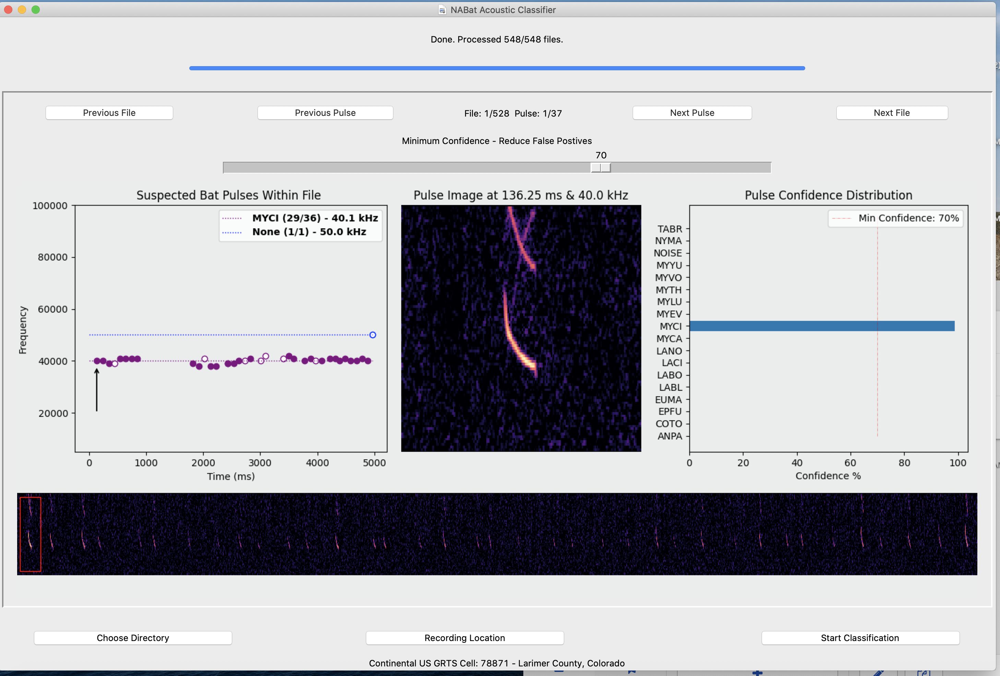

# NABat Acoustic ML

This is a application developed to process full spectrum .wav files using on machine learning techniques developed by the North American Bat Monitoring Program

## Technologies

- Python 3.7
- TensorFlow 2.4
- Librosa 0.8

## Install

- ### Installing Standalone Python with Pyenv and Brew on MacOS

  ```
  brew install xz, pyenv

  env \
  PATH="$(brew --prefix tcl-tk)/bin:$PATH" LDFLAGS="-L$(brew --prefix tcl-tk)/lib" CPPFLAGS="-I$(brew --prefix tcl-tk)/include" PKG_CONFIG_PATH="$(brew --prefix tcl-tk)/lib/pkgconfig" CFLAGS="-I$(brew --prefix tcl-tk)/include" PYTHON_CONFIGURE_OPTS="--with-tcltk-includes='-I$(brew --prefix tcl-tk)/include' --with-tcltk-libs='-L$(brew --prefix tcl-tk)/lib -ltcl8.6 -ltk8.6' --enable-framework" pyenv install 3.7.10
  ```

- ### Custom Install

  ```
  pip3 install -r requirements.txt
  ```

## Running GUI Application

```
python3 nabat_ml_gui.py
```



## Running as library

```
usage: nabat_ml_cli.py [-h] [-s, --sleep SLEEP] [-p, --path PATH]
                       [-g, --grts GRTS] [-u, --uuid UUID] [-v, --save SAVE]

Process full spectrum acoustics.

optional arguments:
  -h, --help         show this help message and exit
  -s, --sleep SLEEP  Integer delay in seconds between checking for new files
  -p, --path PATH    The directory to look for .wav files.
  -g, --grts GRTS    The NABat GrtsId where .wav files were recorded.
  -u, --uuid UUID    The Gottbat detector identifier.
  -v, --save SAVE    Upload result to NABat.

```

## Building Standalone GUI Application for MacOS 10.15.7 Catalina

```
bash build_macOS.sh
```

## Provisional Software Statement

Under USGS Software Release Policy, the software codes here are considered preliminary, not released officially, and posted to this repo for informal sharing among colleagues.

This software is preliminary or provisional and is subject to revision. It is being provided to meet the need for timely best science. The software has not received final approval by the U.S. Geological Survey (USGS). No warranty, expressed or implied, is made by the USGS or the U.S. Government as to the functionality of the software and related material nor shall the fact of release constitute any such warranty. The software is provided on the condition that neither the USGS nor the U.S. Government shall be held liable for any damages resulting from the authorized or unauthorized use of the software.
